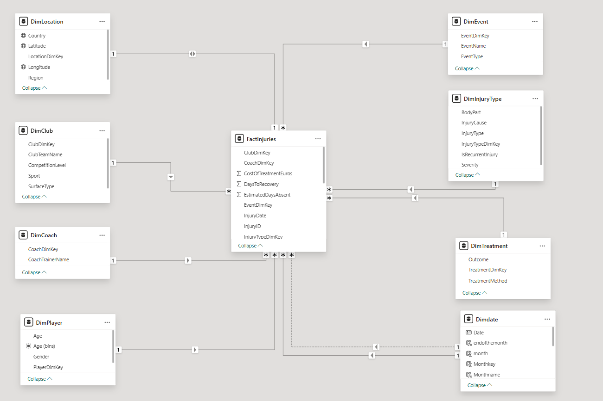
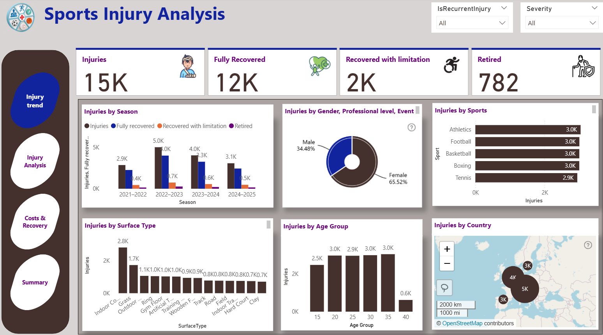
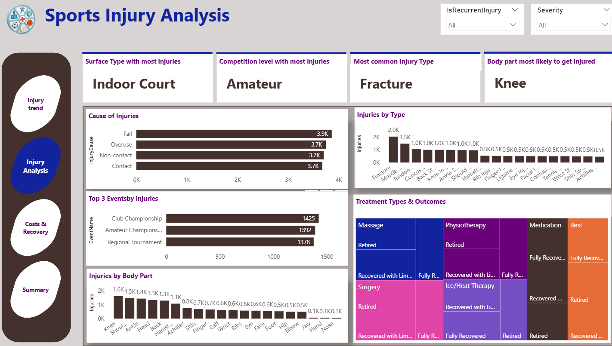
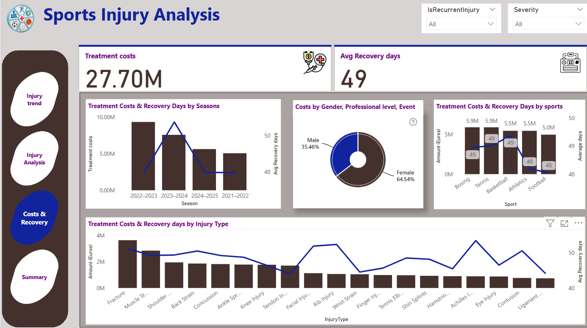
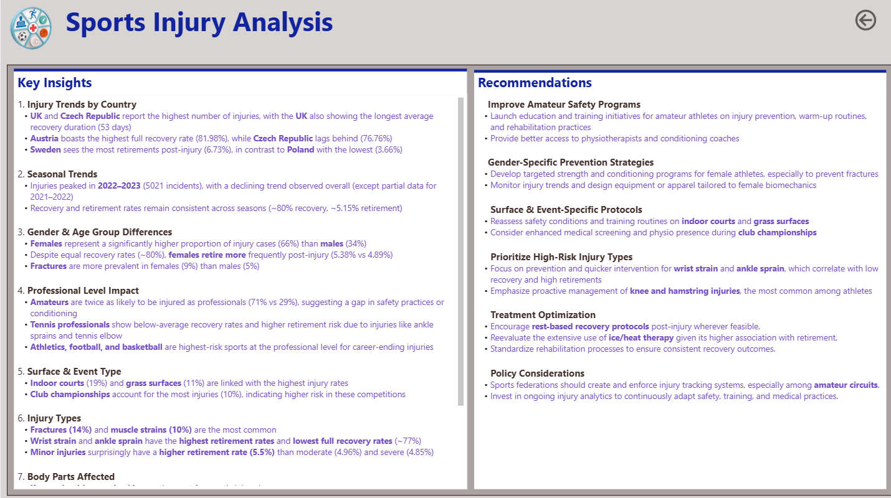

# FP20 Analytics Challenge 29 - Sports Injuries Analytics

### About the Project 
This Power BI project was completed as part of the FP20 Analytics Challenge 29. The task was to explore 15000 records of sports injury records and analyse injury patterns.

---

### Objective
To help identify the most frequent injuries and their associated conditions, evaluate recovery durations, assess treatment effectiveness, discover injury patterns linked to specific sports, regions, and provide recommendations to prevent common injuries and enhance athlete recovery. 

---

### About the dataset

| **Table Name**        | **Description**                                                                                   |
|:-----------------------|:------------------------------------------------------------------------------------------------  |
| `FactInjuries`         | Central fact table with injury events, measures, foreign keys, and date column                    |                               
|`DimPlayer`             | Dimension Table	Stores player demographic details such as age, gender                            |
| `DimInjuryType`        | Dimension Table	Describes types of injuries and their classifications                            |
| `DimLocation`          | Dimension Table	Geographic data including country where the injury occurred                      |
| `DimClub`              | Dimension Table	Information about the team or sports club the player is affiliated with          |
| `DimEvent`             | Dimension Table	Contains event-level data such as match type, surface, and competition level     |
| `DimTreatment`         | Dimension Table	Captures treatment methods applied and recovery outcomes                         |
| `DimCoach`             | Dimension Table	Containing information on the player’s coach or trainer                          |

---

### Tools used
Power BI

---

### Data modelling

---

### Measures (KPIs)
Developed DAX measures to calculate:
1. TotalInjuries
2. Fully Recovered
3. Recovered with Limitation
4. Retirees
5. Treatment costs
6. Avg Recovery Days
7. % Full recovered
8. % Retiree

---

### Insights
1. Injury Trends by Country
UK and Czech Republic report the highest number of injuries, with the UK also showing the longest average recovery duration (53 days)
Austria boasts the highest full recovery rate (81.98%), while Czech Republic lags behind (76.76%)
Sweden sees the most retirements post-injury (6.73%), in contrast to Poland with the lowest (3.66%)

2. Seasonal Trends
Injuries peaked in 2022–2023 (5021 incidents), with a declining trend observed overall (except partial data for 2021–2022)
Recovery and retirement rates remain consistent across seasons (~80% recovery, ~5.15% retirement)

3. Gender & Age Group Differences
Females represent a significantly higher proportion of injury cases (66%) than males (34%)
Despite equal recovery rates (~80%), females retire more frequently post-injury (5.38% vs 4.89%)
Fractures are more prevalent in females (9%) than males (5%)

4. Professional Level Impact
Amateurs are twice as likely to be injured as professionals (71% vs 29%), suggesting a gap in safety practices or conditioning
Tennis professionals show below-average recovery rates and higher retirement risk due to injuries like ankle sprains and tennis elbow
Athletics, football, and basketball are highest-risk sports at the professional level for career-ending injuries

5. Surface & Event Type
Indoor courts (19%) and grass surfaces (11%) are linked with the highest injury rates
Club championships account for the most injuries (10%), indicating higher risk in these competitions

6. Injury Types
Fractures (14%) and muscle strains (10%) are the most common
Wrist strain and ankle sprain have the highest retirement rates and lowest full recovery rates (~77%)
Minor injuries surprisingly have a higher retirement rate (5.5%) than moderate (4.96%) and severe (4.85%)

7. Body Parts Affected
Knees, shoulders, and ankles are the most frequently injured
Elbow and hamstring injuries show the lowest recovery rates
Jaw injuries, although rare (<1%), lead to the highest retirement rate (7.04%)

8. Treatment Effectiveness
Rest yields the highest recovery success (82.27%) and lowest retirement rate (14.18%)
Massage therapy is the least effective treatment (78.38% recovery)
Ice/heat therapy is associated with the highest retirement rate (16.33%)

---

### Recommendations
1. #### Improve Amateur Safety Programs
Launch education and training initiatives for amateur athletes on injury prevention, warm-up routines, and rehabilitation practices
Provide better access to physiotherapists and conditioning coaches

2. #### Gender-Specific Prevention Strategies
Develop targeted strength and conditioning programs for female athletes, especially to prevent fractures
Monitor injury trends and design equipment or apparel tailored to female biomechanics

3. #### Surface & Event-Specific Protocols
Reassess safety conditions and training routines on indoor courts and grass surfaces
Consider enhanced medical screening and physio presence during club championships

4. #### Prioritize High-Risk Injury Types
Focus on prevention and quicker intervention for wrist strain and ankle sprain, which correlate with low recovery and high retirements
Emphasize proactive management of knee and hamstring injuries, the most common among athletes

5. #### Treatment Optimization
Encourage rest-based recovery protocols post-injury wherever feasible.
Reevaluate the extensive use of ice/heat therapy given its higher association with retirement.
Standardize rehabilitation processes to ensure consistent recovery outcomes.

6. #### Policy Considerations
Sports federations should establish and enforce injury tracking systems, particularly within amateur circuits.
Invest in ongoing injury analytics to continuously adapt safety, training, and medical practices.

---

### Power BI report
[Access the PowerBI report](https://github.com/vibvinit/FP20-Analytics-Challenge-29-Vineet/blob/main/FP20_Analytics_Challenge_29_Vineet_Khurana.pbix)

---

### Report Screenshots

---

---

---

---

